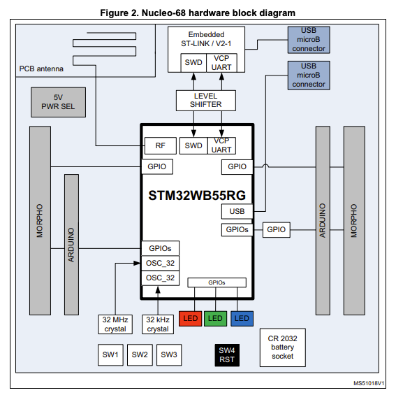
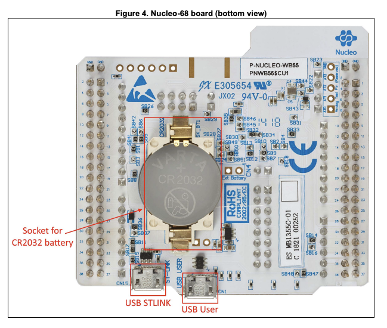
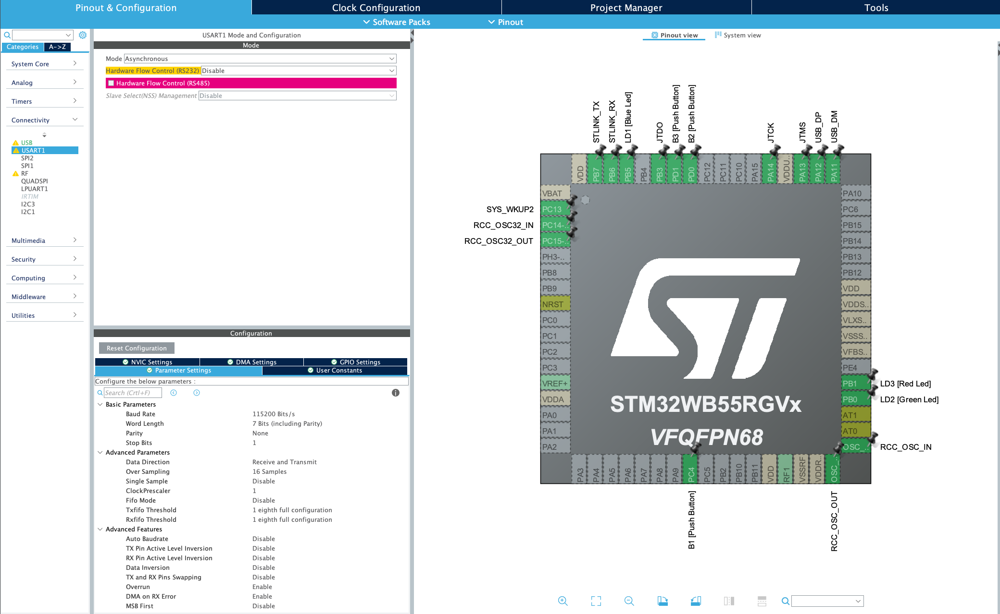
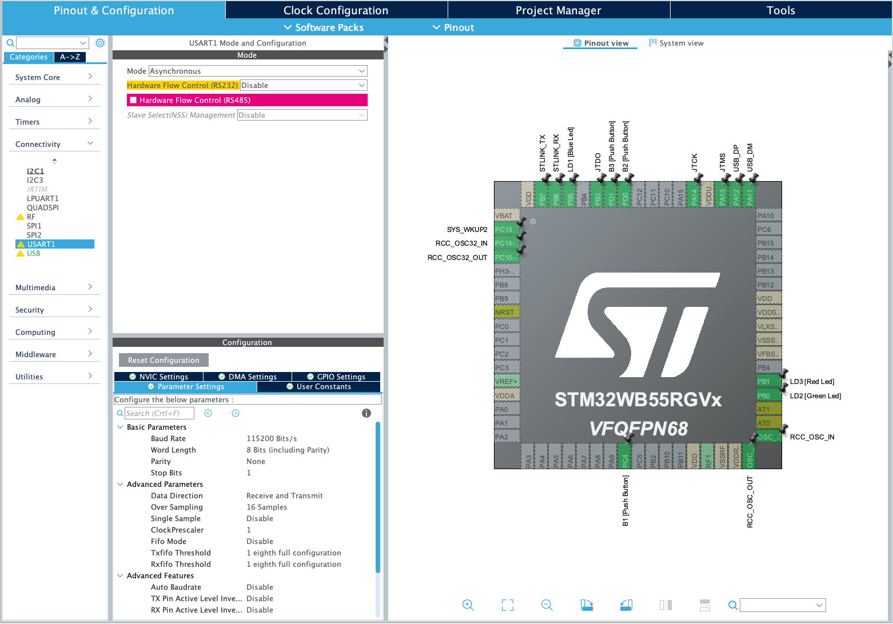
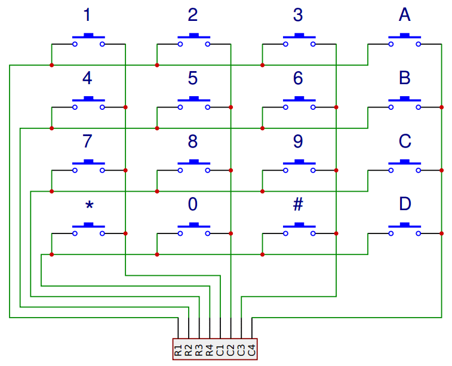

# Laboratory 7

- [Laboratory 7](#laboratory-7)
  - [Introduction](#introduction)
    - [Overview](#overview)
    - [Parts list](#parts-list)
    - [Set Up](#set-up)
  - [Experiment 1: Dumb Terminal for Debugging](#experiment-1-dumb-terminal-for-debugging)
  - [Experiment 2: Matrix Keypad](#experiment-2-matrix-keypad)
- [References](#references)


## Introduction

### Overview

In this lab, you will learn how to use the UART through the USB port. We
will turn this into a debugging terminal, where you can send debugging
information, print statements, etc.

Read the entire lab document! Make a plan before tackling any part of
the lab assignment.

### Parts list

-   STM32WB55 Development Board

-   \(2\) micro-USB to USB-A cables

-   breadboard

-   4x4 matrix keypad

### Set Up

-   Grab your repo from GitHub for this Assignment

-   Start up STM32 and make sure to point to this repo’s workspace

-   Make sure your lab report ends up in `docs` and follows the template
    given in the previous labs.

## Experiment 1: Dumb Terminal for Debugging

In this experiment, you will set up the micro-USB port on the STM32WB55
board to be a UART serial communication link.

To talk to your computer/laptop, you will need a serial interface
program like **PuTTY**, **Kermit**, or **minicom**. For Windows, the
terminal of choice has usually been **puTTY**.  You might also consider **TeraTerm** or **Hercules**.  You can search for it or
you can find it on the Microsoft Store
[here](https://www.microsoft.com/en-us/p/putty-unofficial/9n8pdn6ks0f8?activetab=pivot:overviewtab).
For Mac or Linux, either Kermit or Minicom. I personally use Minicom,
but either program will work. For Mac, either can be installed via
Homebrew. For Linux, check your distribution for how to install
programs. Set the terminal to run in 9600 baud, 8 bit, no parity, 1 stop bit (8N1).

Plug the STM32 Nucleo board into the computer using *both* USB cables,
one in the ST-LINK USB port and the other in the USER USB port. After a
few seconds, the computer should connect with the boards serial port
through the User USB. For Windows, this means that it will be assigned a
COM port. For Linux and Mac, it will be assigned a `/dev/tty.*` device.
In Windows, use the Device Manager to find the COM port for the board.
In Linux/Mac, do a directory listing for `/dev`. Look for something like
`/dev/tty.usbmodem99999` where `99999` could be any set of numbers. The
device file should have the date/time of when you plugged the board in.
Configure the terminal program to use this COM or tty device.

The hardware block diagram for the
[STM32WB55](https://www.st.com/resource/en/user_manual/dm00517423-bluetooth-low-energy-and-802154-nucleo-pack-based-on-stm32wb-series-microcontrollers-stmicroelectronics.pdf)
is:



Note the USB microB connector at the top of the diagram. It is connected
to the UART port on the microcontroller. The USB port is on the bottom
of the board, marked "USB User":



The "User USB" connector schematic:


The UART connection is established over `USB N` and `USB P` lines. Our
board uses USART1 through the USB port.

Set up a new STM32 project called `UART_Over_USB`. Initialize the
default peripherals, save the .ioc file and generate the default code.

In `main.c`, use the Find function to find all of the instances of
`USART1`. Make sure that the interface is configured to be asynchronous.

If you choose to initialize peripherals to default when creating the
project then the UART should already be using the correct pins on the
micro controller. You can check this yourself though by looking at the
user manual and tracing which pins go to the USB/UART interface to the
computer. There are stand alone devices that can do this (common ones
are made by FTDI and Cypress), so if you had one of these you would need
to pick alternate pins and hook it up accordingly.



This is the default configuration for our Nucleo board for the USART1
port. Go to "Connectivity" in the "Pinout & Configuration" window. In
that list, look for "USART1". Make sure the mode is set to
"Asynchronous" and the Hardware Flow Control (RS232) is set to
"Disable". In the Parameter Settings, you will notice the Baud Rate,
Word Length, Parity, and Stop Bits. Make sure that it is set to 9600
Bits/s (or "baud"), 8 Bits (including parity bit), None for parity, and 1 stop bit.
Save the configuration and allow the IDE to generate new code.



Go into `main.c`. In the main block, add the following two lines of
code:

```
/* Initialize all configured peripherals */
MX_GPIO_Init();
MX_USART1_UART_Init();
MX_USB_PCD_Init();
/* USER CODE BEGIN 2 */

/* USER CODE END 2 */
uint8_t data[]="Hello World!\r\n";
HAL_UART_Transmit(&huart1, data, sizeof(data), HAL_MAX_DELAY);
/* Infinite loop */
/* USER CODE BEGIN WHILE */
while (1)
{
  /* USER CODE END WHILE */

  /* USER CODE BEGIN 3 */
}
/* USER CODE END 3 */
```

Note that you only need to add two lines. Go to Projects &gt; Build
Project. Make sure your code compiles with no errors. Run the code or
debug the code with your terminal program running and the User USB
connected. You should see the Hello World message, if you’ve configured
everything properly.

The `HAL_UART_Transmit` function transmits data over the serial port.
`HAL_UART_Receive` receives data over the serial port. You now have a
way to communicate directly with your Nucleo board.

Now, modify your code:

```
/* USER CODE END 2 */
uint8_t data[]="Hello World!\r\n";
HAL_UART_Transmit(&huart1, data, sizeof(data), HAL_MAX_DELAY);
/* Infinite loop */
/* USER CODE BEGIN WHILE */
while (1)
{
  /* USER CODE END WHILE */
HAL_UART_Receive(&huart1, &c, 1, HAL_MAX_DELAY);
if (c)
  HAL_UART_Transmit(&huart1, &c, 1, HAL_MAX_DELAY);
  /* USER CODE BEGIN 3 */
}
```

Run or debug. You will see that you can type in the terminal and your
characters will be echoed back. If you hit "Return" or "Enter", the code
returns back to the first position in the line. Modify this code so that
the carriage return is handled properly; that is, when "Return" or
"Enter" is pressed, the cursor advances to the next line.  You might be able to do this in the dumb terminal program with no changes to your code.  Document how you accomplished this.

Question: Why is it called a "carriage return"?

Save your project, commit your code. Close the project.  You do not need to produce a flowchart or schematic for this experiment.

## Experiment 2: Matrix Keypad

In this experiment, you will interface the 4x4 matrix keypad with the
STM32. There are several ways to do this. We will use a polling
technique that will scan across the columns while turning on one of the
rows at a time.

This is the general schematic:



As Row 1 is SET (and all of the other rows are RESET), poll the columns
to see if a key is pressed. If so, map that key to its value. Ignore
multiple, simultaneous key presses. Create a project called `keypad` in
STM32CubeIDE and write code that outputs keypresses to the UART dumb
terminal. Demonstrate that your code successfully polls the keypad.

Basic GPIO on a microcontroller is split into two categories: inputs and
outputs. You typically configure this when you set up the device
configuration, meaning you pick what pins to use and what direction they
are expecting (More on the software configuration side of this later).
Changing the direction of a pin at runtime after initial configuration
is possible, but for most cases it is not needed (but see
[Charlieplexing](https://en.wikipedia.org/wiki/Charlieplexing) for an
interesting use case). It’s your job as an engineer to figure out what
pins are best used for your design. In this case, the UM2435 reference
manual is essential for determining pin selection; it contains tables of
pins and their capable functions.

It helps to make a table outlining all the pins and functions that you
need with a mapping to what physical pin it is connected to. This
combined with a schematic is required for the lab report.

A button matrix is an important part of optimizing embedded system
designs, because it reduces the number of pins required to interface to
an arbitrary number of buttons.

Think of a standard computer keyboard: they typically have 101 keys and
if each one of those keys needed a distinct GPIO input on a micro
controller then a high pin-count micro controller is needed. These are
expensive, and keyboards are made very cheap so a button matrix is used.

So how do they work?

Instead of each button getting it’s own GPIO line, the buttons are laid
out in a grid where multiple buttons share the same input and output
pins.

You must "scan" the rows and columns in order to properly read out the
matrix. As mentioned earlier you will pick either the rows or the
columns to be outputs and the opposite as inputs. For the rest of this
explanation I am choosing the columns to be my outputs and the rows to
be my inputs.

A scan involves energizing each individual column sequentially and
reading out the rows at each step. For example if Column 2 is energized
and you see that Row 3 is "on" then you know that the number 8 (see the
schematic) is being pressed.

There are a few implementation details that you will have to work out on
your own. For instance: when will you scan the keypad? You can
periodically scan the keypad using a timer interrupt, or you can try
using pin interrupts and only scan when you need to. A poor
implementation of this can hog all your processor time, and you don’t
want to miss that time keeping interrupt!

Other considerations include key ghosting and bounce. Key ghosting is when it is ambiguous as to what key was pressed due to multiple keys being pressed
at the same time. This can be solved in hardware using diodes to prevent
signals from shorting together but these cost money (and are not
included in your kit). Also, since these are normal buttons, debounce
must also be accounted for.

Without the diodes, mashing multiple buttons you will short out the
several of the output pins (look at the schematic and make sure you
understand why that is). This is safe on the STM32 chips since the
output pins are current limited, but this might not always be the case
so be careful when working with other devices.

Once you have demonstrated that you can detect the button and assign it
a value, create another project called `calc`. In this project, you will
pull everything together and make a calculator that uses the number
buttons to enter in the numbers. The **A** button will represent add and
the **B** button will represent subtract. The **C** button will
represent clear and the **D** button will represent equals. Create a
basic calculator, pushing the output to the UART terminal.

Take screenshots of your terminal window, showing some examples of both
addition and subtraction. You should be able to do this for any number
of addends or subtrahends. For example, your calculator should be able
to do *100 + 200 + 300 + 400 = 1000* as well as *200 - 100 = 100*.
Combinations of operators should also be possible: *500 + 200 - 300 =
400*. Order of operations are from left to right. No parentheses.
Consider *only* postive integers as the input and both negative and positive for the output (for example, if you performed the operation *100 - 400 = -300*). Do not concern
yourself with float point numbers for this experiment.

A complete lab report will contain a schematic, a flowchart, a table
showing the GPIO pins used, and appropriate output.

You are welcome to use the oscilloscope to debug the hardware. Document
this in your lab report, if needed.

# References

1.  More on keypad matrix theory with some great animations
    [here](http://pcbheaven.com/wikipages/How_Key_Matrices_Works/)

2.  User manual for the Nucleo-WB55 containing useful information on how
    to interface to the board itself:
    [UM2435](https://www.st.com/resource/en/user_manual/dm00517423-bluetooth-low-energy-and-802154-nucleo-pack-based-on-stm32wb-series-microcontrollers-stmicroelectronics.pdf)

3.  Reference manual for the WB55 containing in depth information about
    how to program the chip including it’s peripherals
    [RM0434](https://www.st.com/content/ccc/resource/technical/document/reference_manual/group0/83/cf/94/7a/35/a9/43/58/DM00318631/files/DM00318631.pdf/jcr:content/translations/en.DM00318631.pdf)

4.  Always make use of example code when you can (just make sure to
    attribute it in your lab report). The full suite of official WB55
    code, including drivers and example code, can be found
    [here](https://github.com/STMicroelectronics/STM32CubeWB/)

5.  How to use `printf()` with stm32 outlined
    [here](https://shawnhymel.com/1873/how-to-use-printf-on-stm32/)
